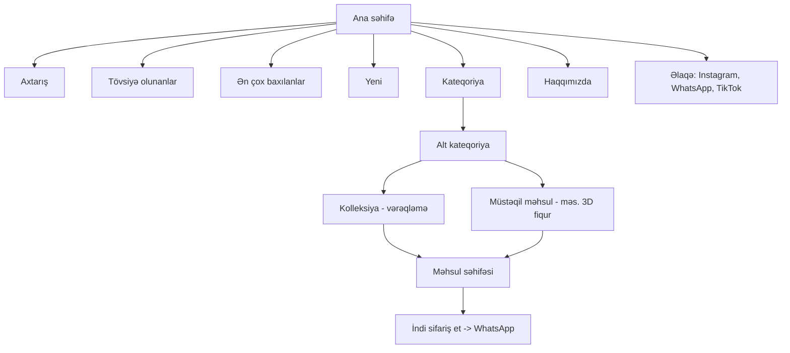
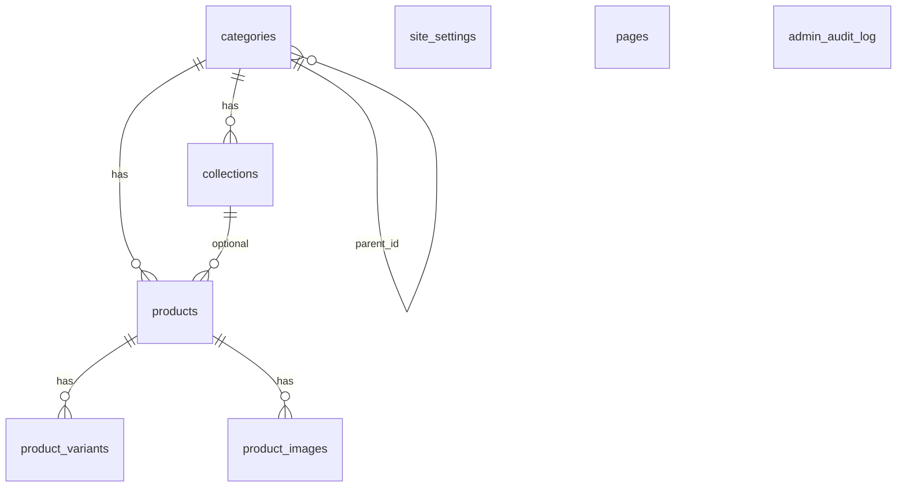

# Kavi Gifts — Hədiyyəlik Kataloq Saytı: İcra Planı (v2)

## Məqsəd
Qeydiyyatsız, müasir e-ticarət məntiqli (axtarış, tövsiyə olunanlar, ən çox baxılanlar, sol kateqoriya paneli) **kataloq + WhatsApp sifariş** saytı. Müştəri baxır → qərar verir → "İndi sifariş et" → WhatsApp-a məhsulun linki ilə hazır mesaj gedir. Admin paneldən hər şey idarə olunur. Minimum xərc, yüksək təhlükəsizlik, açıq rəngli premium dizayn. **Dillər: AZ / RU / EN. Valyuta default: AZN.**

## v2-də nələr dəyişdi (sizin cavablarınıza əsasən)

| # | Tələb | Qərar |
|---|---|---|
| 1 | Kolleksiya qiyməti + hər məhsula fərdi qiymət; kolleksiyasız məhsullar (3D fiqurlar) | **Məhsul müstəqil varlıqdır**, kolleksiya isteğe bağlıdır (`collection_id` NULL ola bilər). Məhsul tipi: `tablo`, `figure_3d`, `other`. Qiymət: məhsul səviyyəsində + kolleksiyada istəyə bağlı paket qiyməti. Variantlar (ölçü/rəng) hər birinin öz qiyməti ilə. |
| 2 | AZ/RU/EN | Tam çoxdilli (URL `/az`, `/ru`, `/en`), admin paneldə hər mətn 3 dildə daxil edilir |
| 3 | Valyuta | Default AZN (₼); məhsulda `currency` sahəsi (AZN/USD/EUR) — dəyişilməsə AZN qalır |
| 4 | Linklər | WhatsApp, Instagram, TikTok — admin paneldən də dəyişə bilir (aşağıya bax) |
| 5 | Watermark | Bəli — yükləmə zamanı public şəkillərə avtomatik vurulur |
| 6 | "Haqqımızda" | Admin paneldən redaktə olunan səhifə; kolleksiyaya ümumi təsvir **və ya** hər məhsula ayrıca təsvir yaza bilərsiniz (ikisi də isteğe bağlı) |

> [!NOTE]
> **WhatsApp:** təsdiqləndi — link `https://wa.me/514933326` olaraq `site_settings`-də saxlanır (admin paneldən dəyişə bilərsiniz). Sifariş linki: `https://wa.me/514933326?text=...`

## Avtomatik tərcümə (AZ → RU/EN)

Admin AZ mətni yazır, **"Tərcümə et"** düyməsi (və ya saxlayanda avtomatik) RU və EN sahələrini doldurur. Admin yoxlayıb düzəldə bilər; əl ilə düzəliş edilmiş sahə sonrakı avtomatik tərcümə ilə **üzərinə yazılmır** (`translation_source: auto|manual` işarəsi).
- Xidmət: **DeepL API Free** (ayda 500 000 simvol pulsuz) və ya Google Cloud Translation (ayda 500 000 simvol pulsuz). Default: DeepL; AZ dəstəyi yoxdursa Google-a keçid — Faza 2-də yoxlanılacaq.
- API açarı yalnız serverdə saxlanır; tərcümə nəticəsi DB-də saxlanır, müştəri baxanda tərcümə sorğusu getmir (xərc ≈ 0).
- Tablo/anime adları (məs. "Attack on Titan") tərcümə olunmur — "tərcümə etmə" siyahısı (glossary) olacaq.

## Domen: kavigifts.az

`.az` domenini yalnız **akkreditasiyalı registrar** vasitəsilə almaq olur (qiymətləri registrarda yoxlayın):
- **Sənəd:** fiziki şəxs üçün şəxsiyyət vəsiqəsi (bəzən FIN); şirkət üçün VÖEN və şəhadətnamə.
- **Qiymət:** təxminən 35–45 AZN/il (registrardan asılıdır).
- **Müddət:** sənəd yoxlanışından sonra adətən 1–3 iş günü.
- **Addımlar (siz edəcəksiniz):** 1) registrar seçin (məs. Hostinq.az, Azhosting.az); 2) `kavigifts.az` boşdurmu yoxlayın; 3) sənədi yükləyib ödəyin; 4) aktivləşəndən sonra DNS idarəetməsinə giriş əldə edin — Vercel üçün dəqiq DNS dəyərlərini deploy mərhələsində verəcəyəm.
- **Tövsiyə:** Faza 0–5 domensiz (`*.vercel.app`) gedəcək, domen paralel alınacaq; Faza 6-da bağlanır.

## Texnologiya (minimum xərc)

| Qat | Seçim | Xərc |
|---|---|---|
| Frontend + SSR | Next.js (App Router) + TypeScript + Tailwind | pulsuz |
| i18n | `next-intl` (AZ/RU/EN, hreflang SEO) | pulsuz |
| Tərcümə | DeepL API Free (ehtiyat: Google Translate) | pulsuz (500k simvol/ay) |
| Hosting | Vercel Hobby (və ya Cloudflare Pages) | pulsuz |
| Database | Supabase PostgreSQL (RLS, Auth, Storage) | pulsuz plan |
| Şəkil | Supabase Storage → sonra Cloudflare R2; yükləmədə WebP + 3 ölçü + watermark | pulsuz/çox ucuz |
| Domen | `kavigifts.az` | ~35–45 AZN/il |

> [!IMPORTANT]
> Yeganə məcburi xərc domendir. Orijinal şəkil saxlanmır, yalnız sıxılmış watermarklı WebP → yaddaş tez dolmur.

## Sayt strukturı



Misal ağac: `Tablo > Animelər > Attack on Titan (kolleksiya)` və `3D Fiqurlar > Anime > Levi (müstəqil məhsul)`.

Səhifələr: `/{lang}` ana, `/{lang}/c/[slug]` kateqoriya (sol sidebar, filtr: tip, qiymət aralığı, sıralama), `/{lang}/collection/[slug]` (vərəqləmə/swipe/klaviatura/tam ekran), `/{lang}/p/[slug]` məhsul, `/{lang}/search`, `/{lang}/about`, `/{lang}/contact`, `/admin/*`.

### Qiymət göstərilməsi
Endirim varsa: ~~`25 ₼`~~ qırmızı xətt çəkilmiş köhnə qiymət, altında yeni qiymət `19 ₼`. Variantlı məhsulda: "`19 ₼`-dan" və variant seçimi (məs. 3D fiqur: 10 sm / 20 sm). Kolleksiyada paket qiyməti varsa: "Bütün kolleksiya: X ₼" bloku.

### WhatsApp mesajı (seçilmiş dildə)
```
https://wa.me/994514933326?text=Salam! Bu məhsulu sifariş etmək istəyirəm:
📌 Levi 3D fiqur (FIG-004) — 20 sm
💰 45 ₼
🔗 https://kavigifts.az/az/p/levi-3d-figure
```
Kolleksiya vərəqləməsində aktiv səhifənin məhsul kodu/linki düşür. Kolleksiyanın paket sifarişi düyməsi də var.

## Məlumat bazası



Çoxdilli sahələr `jsonb` ilə: `{"az":"...","ru":"...","en":"..."}` (AZ məcburi, qalanları boşdursa AZ göstərilir).

- **categories**: `id, parent_id, name jsonb, slug, sort_order, is_active, image_url`
- **collections**: `id, category_id, name jsonb, slug, description jsonb (ümumi haqqında, isteğe bağlı), cover_image, bundle_price null, bundle_sale_price null, currency default 'AZN', is_featured, is_active, sort_order`
- **products**: `id, category_id, collection_id NULL, type (tablo|figure_3d|other), code unique, title jsonb, slug, description jsonb (isteğe bağlı), base_price null, sale_price null, currency default 'AZN', is_featured, is_active, view_count, search_tsv`
- **product_variants**: `id, product_id, label jsonb (məs. "20 sm"), price, sale_price, sku, is_active` — varsa məhsulun qiyməti variantlardan gəlir
- **product_images**: `id, product_id, url_thumb/medium/large, sort_order`
- **pages**: `key (about), content jsonb (3 dildə), updated_at` — Haqqımızda mətni burada
- **site_settings**: `whatsapp_number, instagram_url, tiktok_url, site_name, logo_url, watermark_text/image`
- **admin_audit_log**

Qaydalar: `CHECK (sale_price IS NULL OR sale_price < base_price)`; qiymətsiz məhsul "Qiymət üçün yazın" göstərir; GIN + `pg_trgm` axtarış indeksləri (AZ/RU/EN üzərində); soft delete; bütün dəyişikliklər `supabase/migrations/` faylları ilə.

Gələcək hesab sistemi: `profiles` cədvəli sonradan əlavə olunacaq, hazırkı struktur buna manedə deyil.

## Admin panel
1. Kateqoriya / alt kateqoriya (sıralama drag&drop, 3 dildə ad)
2. Kolleksiya: təsvir (isteğe bağlı), paket qiyməti, üz qabığı
3. Məhsul: tip seçimi, kolleksiyaya aid/müstəqil, fərdi qiymət, endirim, variantlar, **təsvir (isteğe bağlı: ya kolleksiyada ümumi, ya hər məhsulda)**, toplu şəkil yükləmə, avtomatik kod
4. Haqqımızda səhifəsi redaktoru (AZ/RU/EN)
5. Ayarlar: WhatsApp, Instagram, TikTok, loqo, watermark
6. Statistika (ən çox baxılanlar), audit log

## Watermark
Yükləmədə server tərəfdə (`sharp`) hər public ölçüyə yüngül loqo/mətn (`@kavi.gifts_`) çəkilir; orijinal public bucket-də olmur. Qeyd: watermark kopyalamanı çətinləşdirir, tam əngəlləmir.

## Təhlükəsizlik
RLS (anonim yalnız aktiv məlumatı oxuyur), admin Auth + 2FA, service key yalnız serverdə, CSP/HSTS və başlıqlar, Zod validasiya, yükləmə tip/ölçü limiti, rate-limit (axtarış, baxış sayğacı, 24 saatda 1 baxış), gündəlik backup + həftəlik `pg_dump`, `npm audit`/Dependabot, `/admin` `noindex`.

## Performans
ISR + `revalidateTag`, `next/image` WebP, lazy loading, vərəqləmədə yalnız qonşu 2 səhifə preload, səhifələmə (24/səhifə), Lighthouse ≥ 90.

## Dizayn
Krem-ağ fon `#FAF8F5`, mətn `#2B2B2B`, qızılı aksent `#C9A66B`, endirim `#E4572E`; Playfair Display + Inter (kiril dəstəyi yoxlanılacaq); sol sidebar (mobil drawer), dil dəyişdirici (AZ/RU/EN) başlıqda, skeleton yükləmə, 404.

## Fazalar

| Faza | Məzmun |
|---|---|
| 0 | Repo, Next.js, Tailwind, next-intl, Supabase, `AGENTS.md`, `docs/` |
| 1 | DB sxemi, migration, RLS, seed (nümunə: Tablo>Animelər>AOT, 3D Fiqurlar) |
| 2 | Admin auth, CRUD (kateqoriya/kolleksiya/məhsul/variant), şəkil yükləmə + watermark |
| 3 | Müştəri UI: ana, sidebar, kateqoriya, axtarış, dil dəyişdirici |
| 4 | Vərəqləmə, qiymət/endirim/variant, WhatsApp, Haqqımızda, Əlaqə |
| 5 | Təhlükəsizlik, performans, SEO (sitemap, hreflang, OG) |
| 6 | Deploy, domen, backup, test |

## AI yaddaş sistemi
`AGENTS.md` (qaydalar: işə başlamazdan əvvəl `docs/PROGRESS.md` + `DECISIONS.md` oxu, bitirdikdən sonra yenilə), `docs/PROGRESS.md`, `CHANGELOG.md`, `DECISIONS.md`, `DB_SCHEMA.md`, `RUNBOOK.md`, nömrəli `supabase/migrations/`.

## Yoxlama
**Avtomatik:** `npm run lint`, `typecheck`, `build`, Playwright E2E (3 dildə naviqasiya, axtarış, endirimli qiymət, variant, WhatsApp link formatı), RLS testi.
**Əl ilə:** admin ilə kolleksiya və müstəqil 3D fiqur əlavə et; saytda yoxla; watermark görünür; telefon; `/admin` girişsiz açılmır.

## Təsdiq üçün qalan suallar
1. WhatsApp nömrəsi `994514933326` düzgündürmü?
2. RU/EN tərcümələri siz daxil edəcəksiniz, yoxsa AZ yazanda avtomatik tərcümə təklif edək (admin yoxlayıb təsdiq edər)? Default: əl ilə, boş qalsa AZ göstərilir.
3. Domen adı hazırdırmı (məs. `kavigifts.az`)?

Təsdiq etsəniz, Faza 0-dan başlayıram.
